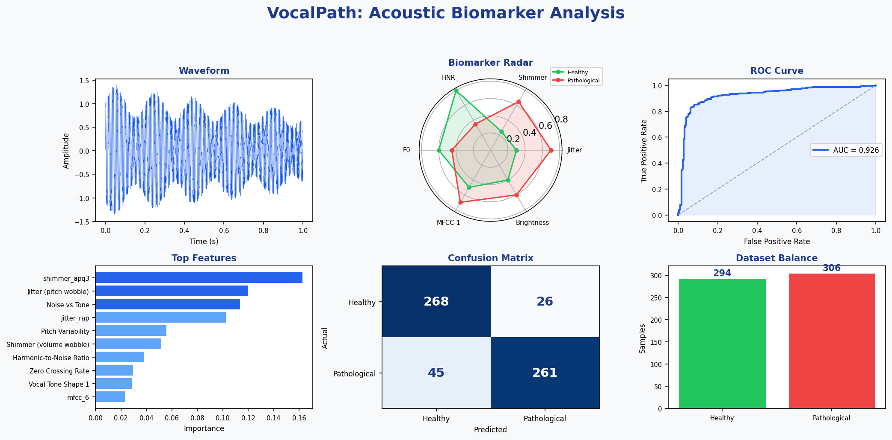

# VocalPath: Acoustic Biomarker Analysis for Voice Pathology

A machine learning tool for voice pathology screening through acoustic biomarker extraction and classification. Built with Python, Streamlit, Praat/Parselmouth, and Librosa.



## Overview

VocalPath extracts **26 clinically validated acoustic features** from voice recordings and classifies them as healthy or potentially pathological using a trained classifier. The tool provides interactive visualizations comparing extracted features against healthy baselines.

Voice changes — particularly persistent hoarseness — are among the earliest symptoms of **laryngeal cancer**, one of the most common head-and-neck cancers (American Cancer Society, 2024). An automated screening tool could flag at-risk individuals for timely ENT referral and laryngoscopy, potentially improving early detection rates in under-served communities.

**This is a research prototype and is not intended for clinical diagnosis.**

> **[▶ Try the live demo on Streamlit Cloud](https://vocalpath-acoustic-biomarker.streamlit.app/)**

## Features

- **26 acoustic biomarkers** including jitter, shimmer, HNR, MFCCs, spectral features
- **Multi-model comparison** (Random Forest, SVM, Logistic Regression) with 5-fold stratified CV
- **Interactive visualizations**: waveform, MFCC spectrogram, radar chart, confusion matrix, ROC curve
- **Downloadable HTML report** for each analysis
- **Methodology documentation** with clinical references

## Quick Start

```bash
# Clone and setup
git clone https://github.com/erinerinchan/vocalpath-acoustic-biomarker.git
cd vocalpath-acoustic-biomarker
python -m venv venv
venv\Scripts\activate          # Windows
# source venv/bin/activate     # macOS/Linux

# Install dependencies
pip install -r requirements.txt

# Generate data and train model
python generate_demo_data.py
python train_model.py

# Generate test audio files (optional)
python generate_sample_audio.py

# Launch the app
streamlit run app.py
```

## Project Structure

```
vocal-path-ai/
├── app.py                    # Streamlit web application
├── generate_demo_data.py     # Synthetic data generation with realistic overlap
├── train_model.py            # Multi-model training and evaluation
├── generate_sample_audio.py  # Synthetic test .wav generator
├── generate_readme_demo.py   # Generates README demo image
├── train_spectrogram_cnn.py  # Mel-spectrogram CNN (deep learning, optional)
├── tests/
│   └── test_pipeline.py      # Unit tests for core pipeline
├── .streamlit/
│   └── config.toml            # Streamlit Cloud theme config
├── requirements.txt
├── .gitignore
├── data/
│   └── features.csv          # Extracted feature dataset
├── model/
│   ├── rf_classifier.joblib  # Trained model
│   ├── feature_names.joblib  # Feature column names
│   ├── metrics.json          # Cross-validation results
│   ├── confusion_matrix.csv  # CV confusion matrix
│   ├── roc_data.csv          # ROC curve data
│   └── feature_importance.csv
├── notebooks/
│   └── eda.ipynb             # Exploratory data analysis
├── screenshots/
│   └── demo.png              # README demo image
├── samples/
│   ├── healthy_vowel.wav     # Test audio (synthetic)
│   └── pathological_vowel.wav
└── README.md
```

## Methodology

### Acoustic Features

| Category | Features | Tool |
|---|---|---|
| Perturbation | Jitter (local, RAP), Shimmer (local, APQ3), HNR | Praat/Parselmouth |
| Spectral | MFCCs (1-13), Centroid, Bandwidth, Flatness, Rolloff | Librosa |
| Temporal | ZCR, RMS, F0 (mean, std) | Both |

### Classification

Three models compared via 5-fold stratified cross-validation:
- Random Forest (100 trees, max depth 10)
- SVM (RBF kernel)
- Logistic Regression

Best model selected by F1 score. All models use StandardScaler preprocessing and balanced class weights.

### Data

Current model is trained on **synthetic data** with distributions based on published clinical ranges. The data includes:
- Realistic inter-class overlap (targeting ~85% accuracy, matching published SVD benchmarks)
- Inter-feature correlations via a latent severity model
- 5% label noise to simulate diagnostic ambiguity

For production, replace with real clinical datasets (e.g., Saarbrücken Voice Database).

## Clinical Validity & Limitations

### Technical Validity
- Best model achieves ~88% accuracy via 5-fold stratified cross-validation on synthetic data
- Performance metrics (precision, recall, F1, AUC) reported transparently in the app
- Feature extraction uses Praat and Librosa — standard tools in published voice-pathology research

### Clinical Validity Gaps
- **No real-patient validation** — model trained only on synthetic samples
- **No external dataset testing** — not evaluated on SVD, MEEI, or other clinical corpora
- **No demographic sub-group analysis** — performance may vary by age, sex, accent, or language
- **No prospective study** — not tested alongside ENT specialists in real-world settings
- **Recording conditions uncontrolled** — consumer microphones and ambient noise introduce untested variability

### What Full Clinical Validation Would Require
1. IRB/ethics approval for patient voice collection
2. Gold-standard labels via laryngoscopy (following STARD guidelines)
3. External validation on ≥1 independent clinical dataset
4. Sub-group analysis for bias across demographics
5. Transparent reporting per TRIPOD checklist

## Benefits & Risks of AI in Voice Screening

### Potential Benefits
- **Early detection** — voice changes can appear before other symptoms
- **Accessibility** — smartphone-based screening for under-served communities
- **Reduced clinician workload** — pre-screening prioritises specialist referrals
- **Objective measurement** — quantitative features complement subjective evaluation
- **Patient empowerment** — longitudinal self-monitoring with shareable results

### Potential Risks
- **False negatives** — missed pathology could delay treatment
- **False positives** — unnecessary anxiety and specialist visits
- **Over-reliance** — users may trust the tool beyond its validation level
- **Data privacy** — voice is biometric data; storage/transmission must comply with GDPR/HIPAA
- **Bias and fairness** — under-represented groups may receive worse predictions
- **Regulatory gap** — deployment without CE/FDA clearance poses safety and legal risks

### Ethical Safeguards in This Prototype
- Clear "research prototype" disclaimers shown before every result
- No user recordings are stored or transmitted
- Limitation warnings advise professional consultation
- All model performance data openly reported

## Spectrogram-Based Deep Learning (Experimental)

In addition to the tabular pipeline, `train_spectrogram_cnn.py` implements an alternative approach: a CNN that classifies voice pathology directly from **mel-spectrogram images**. This preserves temporal patterns that frame-averaged features discard.

- Architecture: 3×Conv2D + BatchNorm + MaxPool → Dense(128) → Sigmoid
- Input: 128-band mel-spectrograms from 3-second synthetic vowels
- Optional dependency: `pip install tensorflow`

The tabular pipeline is used in the app for interpretability; the CNN demonstrates deeper audio-ML capability.

> **Note on CNN accuracy:** The CNN achieves 100% accuracy / AUC 1.0 on synthetic audio, where pathological markers (jitter, sub-harmonics, noise) are programmatically injected with clear separation. This performance is expected to drop significantly on real clinical recordings, where pathology manifests with far more variability. The metric demonstrates the pipeline works correctly — not that the task is solved.

## Future Directions

- **Self-supervised models**: Fine-tuning wav2vec 2.0 or HuBERT on clinical voice data for richer representations
- **Whisper embeddings**: Using OpenAI Whisper's intermediate features for voice quality analysis
- **Real clinical validation**: Testing on SVD, MEEI, or hospital-collected laryngoscopy-confirmed samples
- **Longitudinal monitoring**: Tracking voice changes over weeks to detect gradual deterioration (relevant for early cancer)
- **mHealth deployment**: Smartphone app with periodic voice sampling and trend alerts

## References

1. Teixeira, J.P. et al. (2013). "Vocal Acoustic Analysis — Jitter, Shimmer and HNR Parameters." *Procedia Technology*, 9.
2. Godino-Llorente, J.I. et al. (2006). "Dimensionality Reduction of a Pathological Voice Quality Feature Set." *IEEE Trans. BME*, 53(10).
3. Martinez, D. et al. (2012). "Voice Pathology Detection on the Saarbrucken Voice Database."
4. Boersma, P. & Weenink, D. (2023). Praat: doing phonetics by computer.
5. American Cancer Society (2024). "Signs and Symptoms of Laryngeal and Hypopharyngeal Cancers."
6. Baevski, A. et al. (2020). "wav2vec 2.0: A Framework for Self-Supervised Learning of Speech Representations." *NeurIPS*.
7. Hsu, W.-N. et al. (2021). "HuBERT: Self-Supervised Speech Representation Learning by Masked Prediction." *IEEE/ACM Trans. ASLP*.
8. Hemmerling, D. et al. (2016). "Voice data mining for laryngeal pathology assessment." *Computers in Biology and Medicine*, 69.

## License

MIT
